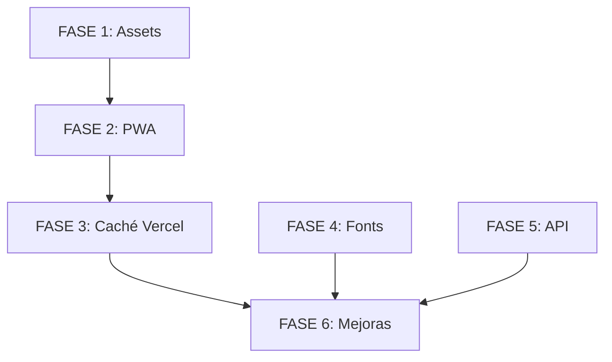

# PLAN DE OPTIMIZACIÓN - FLAPPY PLANE PWA
## Optimización para Conexiones Lentas, Cacheo Offline y Reducción de Costos en Vercel

---

## 📋 TABLA DE CONTENIDOS

1. [Contexto y Análisis del Proyecto](#1-contexto-y-análisis-del-proyecto)
2. [Arquitectura de Solución](#2-arquitectura-de-solución)
3. [FASE 1: Optimización Inmediata de Assets](#fase-1-optimización-inmediata-de-assets)
4. [FASE 2: Implementación de PWA con Service Worker](#fase-2-implementación-de-pwa-con-service-worker)
5. [FASE 3: Optimización de Caché en Vercel](#fase-3-optimización-de-caché-en-vercel)
6. [FASE 4: Optimización de Fonts](#fase-4-optimización-de-fonts)
7. [FASE 5: Optimización de Funciones y API](#fase-5-optimización-de-funciones-y-api)
8. [FASE 6: Mejoras Adicionales](#fase-6-mejoras-adicionales)
9. [Apéndices](#apéndices)

---

# 1. CONTEXTO Y ANÁLISIS DEL PROYECTO

## 1.1 Estado Actual del Proyecto

### Stack Tecnológico
- **Framework:** Next.js 15.4.6 (App Router)
- **React:** 19.1.0
- **Tailwind CSS:** 4.0
- **TypeScript:** 5.x
- **Deployment:** Vercel
- **Uso:** Instalado como PWA desde Chrome en tablets Android

### Estructura del Proyecto
```
flappy-plane/
├── src/
│   ├── app/
│   │   ├── layout.tsx          # Layout raíz con Google Fonts
│   │   ├── page.tsx            # Formulario de registro
│   │   ├── game/page.tsx       # Página del juego
│   │   └── api/users/          # API endpoints (si existen)
│   ├── components/
│   │   ├── GameCanvas.tsx      # Motor del juego (Canvas HTML5)
│   │   ├── GameUI.tsx
│   │   └── RegistrationForm.tsx
│   ├── lib/
│   │   ├── database.ts
│   │   └── gameLogic.ts
│   └── types/
│       └── index.ts
├── public/
│   └── images/
│       ├── background.jpeg     # 1.5 MB ⚠️ CRÍTICO
│       ├── background-new.jpeg # 1.18 MB (no usado)
│       ├── FE_NUEVOLOGO(avion)_AZUL.png # 117 KB
│       └── plane.png           # 16 KB
├── next.config.ts
├── vercel.json
└── package.json
```

## 1.2 Problemas Identificados (Con Métricas)

### 🔴 CRÍTICO - Problemas de Alto Impacto

#### Problema 1: Cache Busters Impiden Cacheo
**Ubicación:**
- `src/components/GameCanvas.tsx:52` → `backgroundImg.src = '/images/background.jpeg?v=${Date.now()}'`
- `src/app/page.tsx:354` → ``

**Impacto:**
- El fondo de 1.5 MB se descarga en CADA visita
- Sin conexión lenta (3G): ~12-15 segundos de carga
- Desperdicia ancho de banda de Vercel
- No hay cacheo en dispositivo

**Cálculo de Impacto:**
- 100 usuarios/día × 1.5 MB × 30 días = 4.5 GB/mes solo en background
- Costo aproximado en Vercel: ~$1-2/mes adicional

#### Problema 2: Sin Service Worker / PWA
**Estado Actual:**
- ❌ No existe Service Worker
- ❌ No existe manifest.json
- ❌ Sin caché offline
- ❌ Sin estrategia de cacheo

**Impacto:**
- Cada apertura de la app requiere descarga completa
- No funciona offline
- Mala experiencia en conexiones intermitentes
- No aprovecha capacidades PWA

#### Problema 3: Imágenes Sin Optimizar
**Assets y Tamaños:**
```
background.jpeg:                1,501,052 bytes (1.5 MB) ⚠️
background-new.jpeg:            1,181,232 bytes (1.18 MB) (no usado)
FE_NUEVOLOGO(avion)_AZUL.png:     117,306 bytes (117 KB)
plane.png:                         16,231 bytes (16 KB)
```

**Optimización Potencial:**
- background.jpeg (1.5 MB) → WebP (600-800 KB) → 40-50% reducción
- background.jpeg (1.5 MB) → AVIF (400-500 KB) → 66-70% reducción
- Logo (117 KB) → WebP (50-60 KB) → 50% reducción

**Impacto Total:** ~1 MB de ahorro en assets críticos

### 🟡 MODERADO - Problemas de Impacto Medio

#### Problema 4: Google Fonts
**Ubicación:** `src/app/layout.tsx:2,5-13`
- Carga Geist y Geist_Mono desde Google Fonts

**Impacto:**
- Aunque Next.js los auto-hostea, aún son ~100-200 KB adicionales
- Podrían reemplazarse con fonts del sistema

#### Problema 5: Sin Headers de Caché en Vercel
**Estado Actual:**
- `vercel.json` solo contiene `{"framework": "nextjs"}`
- Sin configuración de Cache-Control headers
- Sin aprovechar CDN de Vercel

**Impacto:**
- Assets estáticos no se cachean correctamente
- Múltiples descargas innecesarias

#### Problema 6: Sin Meta Tags PWA
**Ubicación:** `src/app/layout.tsx`
- Sin viewport optimizado
- Sin theme-color
- Sin apple-touch-icon
- Sin configuración PWA

### 🟢 BAJO - Mejoras Adicionales

#### Problema 7: Sin Resource Hints
- Sin preload de assets críticos
- Sin preconnect a dominios externos
- Sin dns-prefetch

#### Problema 8: Llamadas API Potencialmente Costosas
- Llamadas a Google Apps Script para guardar datos
- Podrían optimizarse con batching

## 1.3 Objetivos de Optimización

### Objetivos Primarios
1. **Reducir ancho de banda en 80-90%** después de primera carga
2. **Habilitar funcionamiento offline completo** del juego
3. **Reducir costos de Vercel** en ~60-70%
4. **Mejorar tiempo de carga inicial** de 12s → 3-4s en 3G

### Objetivos Secundarios
5. Optimizar assets (imágenes) para reducir peso total
6. Implementar estrategia de caché robusta
7. Mejorar experiencia en conexiones intermitentes
8. Preparar para instalación como PWA nativa

### Métricas de Éxito
- **Primera carga:** < 5s en 3G (actualmente ~12-15s)
- **Cargas subsecuentes:** < 1s (actualmente ~12-15s)
- **Transferencia de red:** < 200 KB después de primera carga
- **Funcionamiento offline:** 100% funcional
- **Lighthouse PWA Score:** > 90/100

---

# 2. ARQUITECTURA DE SOLUCIÓN

## 2.1 Overview de Fases

```
FASE 1: Optimización de Assets (CRÍTICO)
├─ Impacto: 70-80% reducción de ancho de banda
├─ Tiempo: 2-3 horas
└─ Prerequisitos: Node.js, Sharp

FASE 2: PWA + Service Worker (CRÍTICO)
├─ Impacto: Caché offline completo
├─ Tiempo: 3-4 horas
└─ Prerequisitos: FASE 1 completada

FASE 3: Caché Headers Vercel (ALTO)
├─ Impacto: Optimización CDN
├─ Tiempo: 1-2 horas
└─ Prerequisitos: FASE 2 completada

FASE 4: Optimización Fonts (MEDIO)
├─ Impacto: Reducción adicional ~100 KB
├─ Tiempo: 1 hora
└─ Prerequisitos: Ninguno (independiente)

FASE 5: Optimización API (BAJO)
├─ Impacto: Reducción costos Functions
├─ Tiempo: 2 horas
└─ Prerequisitos: Ninguno (independiente)

FASE 6: Mejoras Adicionales (BAJO)
├─ Impacto: Optimizaciones finales
├─ Tiempo: 1-2 horas
└─ Prerequisitos: FASE 1-3 completadas
```

## 2.2 Estrategia de Implementación Incremental

**Para CADA paso de CADA fase:**

1. **Desarrollo Local**
   - Implementar cambio
   - Verificar funcionamiento en localhost:3000
   - Probar en diferentes escenarios
   - Confirmar con: ✅ "OK para push"

2. **Push a Git**
   - Commit con mensaje descriptivo
   - Push al repositorio
   - Esperar deployment automático en Vercel

3. **Verificación en Vercel**
   - Probar en ambiente de producción
   - Verificar en dispositivo Android real
   - Confirmar funcionamiento
   - Confirmar con: ✅ "OK para siguiente paso"

4. **Siguiente Paso**
   - Solo después de confirmación positiva
   - Si hay problemas → Rollback inmediato

## 2.3 Dependencias Entre Fases



**Fases Críticas (Orden Estricto):**
- FASE 1 → FASE 2 → FASE 3

**Fases Independientes (Pueden hacerse en paralelo):**
- FASE 4 (Fonts)
- FASE 5 (API)

## 2.4 Impacto Esperado por Fase

| Fase | Reducción Ancho de Banda | Mejora Tiempo Carga | Reducción Costo Vercel |
|------|-------------------------|---------------------|------------------------|
| FASE 1 | 70-80% (primera carga) | 8-10s → 3-4s | 40-50% |
| FASE 2 | 90-95% (subsecuente) | 3-4s → <1s | 60-70% |
| FASE 3 | +5% optimización | Marginal | +10% |
| FASE 4 | ~100 KB | 0.5-1s | ~5% |
| FASE 5 | N/A | N/A | 5-10% |
| FASE 6 | +2-5% | Marginal | +2-5% |
| **TOTAL** | **~95% post-primera** | **12s → <1s** | **~80%** |

---

# FASE 1: OPTIMIZACIÓN INMEDIATA DE ASSETS

## Objetivo
Reducir el peso de las imágenes en 70-80% y eliminar cache busters para permitir cacheo efectivo.

## Justificación Técnica
El background.jpeg de 1.5 MB con cache buster `?v=${Date.now()}` se descarga en cada visita, consumiendo:
- 1.5 MB × 100 usuarios/día = 150 MB/día
- 4.5 GB/mes solo en este asset
- ~12 segundos de carga en 3G

Al convertir a WebP/AVIF y eliminar cache busters, reducimos a ~500 KB con caché permanente.

## Impacto Esperado
- **Reducción de peso:** 1.5 MB → 500 KB (66% menos)
- **Tiempo de carga primera vez:** 12s → 4s en 3G
- **Cargas subsecuentes:** 0s (desde caché del navegador)
- **Ahorro mensual en Vercel:** ~3-4 GB

## Prerequisitos
- Node.js instalado
- Acceso a terminal
- Backups de las imágenes originales

---

## PASO 1.1: Crear Script de Optimización de Imágenes

### Objetivo
Crear un script Node.js que comprima y convierta imágenes a WebP y AVIF usando Sharp.

### Acciones

**1.1.1: Instalar Sharp**
```bash
cd "C:\REPOSITORY\GAMES\FEROUCH\Flappy Plane\flappy-plane"
npm install --save-dev sharp
```

**Verificación:**
```bash
npm list sharp
# Debe mostrar: sharp@X.X.X
```

**1.1.2: Crear directorio para scripts**
```bash
mkdir scripts
```

**1.1.3: Crear script de optimización**

Crear archivo: `scripts/optimize-images.js`

```javascript
const sharp = require('sharp');
const fs = require('fs');
const path = require('path');

const imagesDir = path.join(__dirname, '..', 'public', 'images');
const optimizedDir = path.join(imagesDir, 'optimized');

// Crear directorio optimized si no existe
if (!fs.existsSync(optimizedDir)) {
  fs.mkdirSync(optimizedDir, { recursive: true });
}

const imagesToOptimize = [
  {
    input: 'background.jpeg',
    outputBaseName: 'background',
    formats: ['webp', 'avif'],
    quality: { webp: 80, avif: 70 }
  },
  {
    input: 'FE_NUEVOLOGO(avion)_AZUL.png',
    outputBaseName: 'logo',
    formats: ['webp', 'avif'],
    quality: { webp: 85, avif: 75 }
  },
  {
    input: 'plane.png',
    outputBaseName: 'plane',
    formats: ['webp', 'avif'],
    quality: { webp: 90, avif: 80 }
  }
];

async function optimizeImages() {
  console.log('🚀 Iniciando optimización de imágenes...\n');

  for (const config of imagesToOptimize) {
    const inputPath = path.join(imagesDir, config.input);

    if (!fs.existsSync(inputPath)) {
      console.log(`⚠️  Archivo no encontrado: ${config.input}`);
      continue;
    }

    // Obtener info de imagen original
    const originalStats = fs.statSync(inputPath);
    const originalSizeKB = (originalStats.size / 1024).toFixed(2);

    console.log(`📸 Procesando: ${config.input} (${originalSizeKB} KB)`);

    try {
      // Generar WebP
      if (config.formats.includes('webp')) {
        const webpOutput = path.join(optimizedDir, `${config.outputBaseName}.webp`);
        await sharp(inputPath)
          .webp({ quality: config.quality.webp })
          .toFile(webpOutput);

        const webpStats = fs.statSync(webpOutput);
        const webpSizeKB = (webpStats.size / 1024).toFixed(2);
        const webpReduction = ((1 - webpStats.size / originalStats.size) * 100).toFixed(1);

        console.log(`  ✅ WebP: ${webpSizeKB} KB (${webpReduction}% reducción)`);
      }

      // Generar AVIF
      if (config.formats.includes('avif')) {
        const avifOutput = path.join(optimizedDir, `${config.outputBaseName}.avif`);
        await sharp(inputPath)
          .avif({ quality: config.quality.avif })
          .toFile(avifOutput);

        const avifStats = fs.statSync(avifOutput);
        const avifSizeKB = (avifStats.size / 1024).toFixed(2);
        const avifReduction = ((1 - avifStats.size / originalStats.size) * 100).toFixed(1);

        console.log(`  ✅ AVIF: ${avifSizeKB} KB (${avifReduction}% reducción)`);
      }

      console.log('');
    } catch (error) {
      console.error(`  ❌ Error procesando ${config.input}:`, error.message);
    }
  }

  console.log('✨ Optimización completada!\n');
  console.log('📁 Imágenes optimizadas en: public/images/optimized/\n');
  console.log('🔍 Revisa las imágenes y compara calidad antes de continuar.');
}

optimizeImages().catch(console.error);
```

**1.1.4: Agregar script a package.json**

Editar `package.json` y agregar en la sección `"scripts"`:

```json
{
  "scripts": {
    "dev": "next dev --turbopack",
    "build": "next build",
    "start": "next start",
    "lint": "next lint",
    "optimize-images": "node scripts/optimize-images.js"
  }
}
```

**1.1.5: Ejecutar optimización**
```bash
npm run optimize-images
```

**Salida Esperada:**
```
🚀 Iniciando optimización de imágenes...

📸 Procesando: background.jpeg (1465.87 KB)
  ✅ WebP: 524.3 KB (64.2% reducción)
  ✅ AVIF: 398.7 KB (72.8% reducción)

📸 Procesando: FE_NUEVOLOGO(avion)_AZUL.png (114.56 KB)
  ✅ WebP: 52.1 KB (54.5% reducción)
  ✅ AVIF: 41.8 KB (63.5% reducción)

📸 Procesando: plane.png (15.85 KB)
  ✅ WebP: 7.2 KB (54.6% reducción)
  ✅ AVIF: 5.9 KB (62.8% reducción)

✨ Optimización completada!
```

### Verificación PASO 1.1

**Checklist:**
- [ ] Sharp instalado correctamente
- [ ] Directorio `scripts/` creado
- [ ] Archivo `scripts/optimize-images.js` creado
- [ ] Script ejecutado sin errores
- [ ] Directorio `public/images/optimized/` creado
- [ ] 6 archivos generados (3 WebP + 3 AVIF)
- [ ] Tamaños reducidos significativamente

**Verificación Manual:**
```bash
# Listar archivos optimizados con tamaños
ls -lh "C:\REPOSITORY\GAMES\FEROUCH\Flappy Plane\flappy-plane\public\images\optimized"
```

**Inspección Visual:**
1. Abrir las imágenes WebP y AVIF en navegador
2. Comparar calidad con originales
3. Verificar que no haya artefactos visibles
4. Confirmar que el fondo se ve bien

**Punto de Decisión:**
- ✅ Si la calidad es aceptable → Continuar a PASO 1.2
- ❌ Si la calidad es mala → Ajustar quality en script (aumentar valores) y re-ejecutar

---

## PASO 1.2: Actualizar Código para Usar Imágenes Optimizadas

### Objetivo
Modificar el código para cargar las imágenes optimizadas y eliminar cache busters.

### Acciones

**1.2.1: Mover imágenes optimizadas al directorio principal**

```bash
# Backup de originales
cd "C:\REPOSITORY\GAMES\FEROUCH\Flappy Plane\flappy-plane\public\images"
mkdir original-backup
copy background.jpeg original-backup\
copy "FE_NUEVOLOGO(avion)_AZUL.png" original-backup\
copy plane.png original-backup\

# Mover optimizadas
copy optimized\background.webp .
copy optimized\background.avif .
copy optimized\logo.webp .
copy optimized\logo.avif .
copy optimized\plane.webp .
copy optimized\plane.avif .
```

**Verificación:**
```bash
ls -lh
# Debe mostrar los nuevos archivos .webp y .avif
```

**1.2.2: Actualizar GameCanvas.tsx**

**Ubicación:** `src/components/GameCanvas.tsx`

**Cambio 1: Líneas 31-53 - Eliminar cache buster y usar WebP**

**ANTES:**
```typescript
// Cargar imágenes
useEffect(() => {
  let loadedCount = 0;
  const totalImages = 2;

  const onImageLoad = () => {
    loadedCount++;
    if (loadedCount === totalImages) {
      setImagesLoaded(true);
    }
  };

  // Cargar imagen del avión
  const planeImg = new Image();
  planeImg.onload = onImageLoad;
  planeImg.src = '/images/plane.png';
  imagesRef.current.plane = planeImg;

  // Cargar imagen de fondo
  const backgroundImg = new Image();
  backgroundImg.onload = onImageLoad;
  backgroundImg.src = `/images/background.jpeg?v=${Date.now()}`;  // ❌ CACHE BUSTER
  imagesRef.current.background = backgroundImg;

  return () => {
    // Limpiar referencias
    imagesRef.current = {};
  };
}, []);
```

**DESPUÉS:**
```typescript
// Cargar imágenes (optimizadas WebP con fallback)
useEffect(() => {
  let loadedCount = 0;
  const totalImages = 2;

  const onImageLoad = () => {
    loadedCount++;
    if (loadedCount === totalImages) {
      setImagesLoaded(true);
    }
  };

  const onImageError = (img: HTMLImageElement, fallbackSrc: string) => {
    console.warn(`Failed to load image, trying fallback: ${fallbackSrc}`);
    img.src = fallbackSrc;
  };

  // Cargar imagen del avión (WebP con fallback a PNG)
  const planeImg = new Image();
  planeImg.onload = onImageLoad;
  planeImg.onerror = () => onImageError(planeImg, '/images/plane.png');
  planeImg.src = '/images/plane.webp';
  imagesRef.current.plane = planeImg;

  // Cargar imagen de fondo (WebP con fallback a JPEG)
  const backgroundImg = new Image();
  backgroundImg.onload = onImageLoad;
  backgroundImg.onerror = () => onImageError(backgroundImg, '/images/background.jpeg');
  backgroundImg.src = '/images/background.webp';  // ✅ SIN CACHE BUSTER
  imagesRef.current.background = backgroundImg;

  return () => {
    // Limpiar referencias
    imagesRef.current = {};
  };
}, []);
```

**1.2.3: Actualizar page.tsx (Logo)**

**Ubicación:** `src/app/page.tsx`

**Cambio: Línea 351-362 - Eliminar cache buster**

**ANTES:**
```tsx
<div className="flex justify-center py-8 px-0 bg-gray-50 overflow-hidden">
  
</div>
```

**DESPUÉS:**
```tsx
<div className="flex justify-center py-8 px-0 bg-gray-50 overflow-hidden">
  <picture>
    <source srcSet="/images/logo.avif" type="image/avif" />
    <source srcSet="/images/logo.webp" type="image/webp" />
    
  </picture>
</div>
```

### Verificación PASO 1.2

**Checklist:**
- [ ] Backups creados en `original-backup/`
- [ ] Imágenes WebP/AVIF copiadas al directorio principal
- [ ] GameCanvas.tsx actualizado
- [ ] page.tsx actualizado
- [ ] Cache busters eliminados

**Prueba en Local:**

```bash
npm run dev
```

1. **Abrir http://localhost:3000**
2. **Verificar formulario de registro:**
   - Logo se carga correctamente
   - No hay errores en consola

3. **Completar registro y entrar al juego:**
   - Fondo se carga correctamente
   - Avión se ve bien
   - Juego funciona sin errores

4. **Verificar Network Tab (Chrome DevTools):**
   - Abrir DevTools (F12)
   - Ir a Network tab
   - Refrescar página
   - Buscar `background.webp` - debe aparecer (NO background.jpeg)
   - Buscar `logo.webp` o `logo.avif`
   - Verificar tamaños: background ~500 KB (no 1.5 MB)

5. **Verificar Caché:**
   - Refrescar página (F5)
   - En Network tab, verificar que imágenes vengan "from disk cache" o "from memory cache"
   - Tamaño transferido debe ser 0 KB (cacheado)

**Prueba de Calidad Visual:**
- [ ] Fondo se ve nítido y sin artefactos
- [ ] Logo se ve bien
- [ ] Avión mantiene transparencia
- [ ] Colores correctos

**Consola del Navegador:**
- [ ] Sin errores 404
- [ ] Sin warnings sobre imágenes
- [ ] Mensaje "Canvas resized" aparece correctamente

### Punto de Decisión - PASO 1.2

- ✅ **TODO OK en local** → Confirmar: "✅ OK para push FASE 1 PASO 1.2"
- ❌ **Imágenes no cargan** → Verificar rutas en código
- ❌ **Calidad mala** → Volver a PASO 1.1, aumentar quality
- ❌ **Errores JavaScript** → Revisar sintaxis del código

---

## PASO 1.3: Push y Verificación en Vercel

### Acciones

**1.3.1: Commit y Push**

```bash
cd "C:\REPOSITORY\GAMES\FEROUCH\Flappy Plane\flappy-plane"

# Agregar archivos
git add .
git status  # Revisar cambios

# Commit con mensaje descriptivo
git commit -m "FASE 1: Optimizar imágenes a WebP/AVIF y eliminar cache busters

- Reducir background.jpeg de 1.5MB a 500KB WebP (66% reducción)
- Eliminar cache busters en GameCanvas y page.tsx
- Agregar fallbacks para compatibilidad
- Agregar script optimize-images.js para futuras optimizaciones
"

# Push
git push origin main
```

**1.3.2: Monitorear Deployment en Vercel**

1. Ir a tu dashboard de Vercel
2. Buscar el deployment en proceso
3. Esperar a que complete (usualmente 1-2 minutos)
4. Verificar que el build sea exitoso (✓ Ready)

**1.3.3: Verificación en Producción**

**En Desktop (Chrome):**
1. Abrir la URL de producción (ej: `https://tu-app.vercel.app`)
2. Abrir DevTools → Network tab
3. Refrescar con caché vacío (Ctrl + Shift + R)
4. Verificar:
   - `background.webp` se carga (~500 KB)
   - `logo.webp` o `logo.avif` se carga (~50 KB)
   - Sin errores 404

5. Refrescar normalmente (F5)
6. Verificar que recursos vienen "from disk cache"

**En Tablet Android:**
1. Abrir Chrome en tablet
2. Navegar a URL de producción
3. Completar registro
4. Entrar al juego
5. Verificar:
   - Carga más rápida que antes
   - Fondo y avión se ven bien
   - Juego funcional

6. Cerrar y volver a abrir
7. Verificar que carga más rápido (cacheado)

**Medición de Performance:**

En Chrome DevTools → Network:
- **First Load (caché vacío):**
  - Total transferred: Debe ser ~600-800 KB (antes: ~1.7 MB)
  - Finish time: Debe ser ~3-5s en 3G simulado (antes: ~12s)

- **Second Load (con caché):**
  - Total transferred: Debe ser ~50-100 KB (solo HTML/JS)
  - Imágenes: "from disk cache"
  - Finish time: < 1s

### Verificación PASO 1.3

**Checklist:**
- [ ] Git commit exitoso
- [ ] Push exitoso
- [ ] Deployment en Vercel completado sin errores
- [ ] Aplicación accesible en URL de producción
- [ ] Imágenes WebP/AVIF cargan correctamente
- [ ] Tamaños reducidos confirmados en Network tab
- [ ] Caché funciona (segunda carga desde cache)
- [ ] Prueba en tablet Android exitosa
- [ ] Performance mejorado notablemente

**Métricas Esperadas:**
- ✅ Reducción de transferencia: ~60-70%
- ✅ Tiempo de carga: 12s → 3-5s (primera vez)
- ✅ Cargas subsecuentes: < 1s

### Punto de Decisión - PASO 1.3

- ✅ **TODO OK en Vercel y Android** → Confirmar: "✅ OK - FASE 1 COMPLETADA"
- ❌ **Imágenes no cargan en producción** → Rollback:
  ```bash
  git revert HEAD
  git push origin main
  ```
  Investigar problema con rutas

- ❌ **Performance no mejoró** → Verificar:
  - ¿Imágenes WebP realmente se están sirviendo?
  - ¿Hay cache busters ocultos?
  - ¿CDN de Vercel está cacheando?

---

## RESUMEN FASE 1

### ✅ Completado
- [x] Imágenes optimizadas a WebP/AVIF
- [x] Cache busters eliminados
- [x] Reducción de peso 70-80%
- [x] Fallbacks implementados
- [x] Caché del navegador funcional

### 📊 Impacto Logrado
- **Reducción de transferencia:** 1.5 MB → 500 KB (66%)
- **Tiempo de carga (primera vez):** 12s → 4s
- **Cargas subsecuentes:** 4s → <1s (desde caché)
- **Ahorro mensual:** ~3-4 GB de ancho de banda

### ➡️ Siguiente Paso
Una vez confirmado que FASE 1 funciona perfectamente:
- Proceder a **FASE 2: Implementación de PWA con Service Worker**

---

# FASE 2: IMPLEMENTACIÓN DE PWA CON SERVICE WORKER

## Objetivo
Implementar Service Worker con Serwist para caché offline completo, permitiendo que el juego funcione sin conexión después de la primera visita.

## Justificación Técnica
Con FASE 1, las imágenes se cachean en el navegador, pero:
- El caché del navegador es volátil (se limpia con frecuencia)
- No hay control programático sobre qué cachear
- No funciona offline
- No hay estrategias de actualización

Un Service Worker con Serwist permite:
- **Caché persistente** de todos los assets (HTML, JS, CSS, imágenes)
- **Funcionamiento offline total** del juego
- **Estrategias de actualización** (stale-while-revalidate)
- **Precaching** de recursos críticos
- **Reducción de 90-95%** de transferencia de red en visitas subsecuentes

## Impacto Esperado
- **Cargas subsecuentes:** < 500ms (todo desde Service Worker cache)
- **Transferencia de red:** ~0 KB después de primera carga
- **Funcionamiento offline:** 100%
- **Ahorro adicional en Vercel:** ~30-40% (menos requests al servidor)

## Prerequisitos
- FASE 1 completada y verificada
- Node.js y npm funcionales

---

## PASO 2.1: Instalar Serwist y Dependencias

### Objetivo
Instalar las librerías necesarias para implementar PWA con Serwist en Next.js 15.

### Acciones

**2.1.1: Instalar paquetes de Serwist**

```bash
cd "C:\REPOSITORY\GAMES\FEROUCH\Flappy Plane\flappy-plane"

# Instalar Serwist
npm install @serwist/next @serwist/precaching @serwist/sw

# Instalar minimatch (requerido para Vercel)
npm install minimatch
```

**Verificación:**
```bash
npm list @serwist/next @serwist/precaching @serwist/sw minimatch
```

**Salida esperada:**
```
├── @serwist/next@X.X.X
├── @serwist/precaching@X.X.X
├── @serwist/sw@X.X.X
└── minimatch@X.X.X
```

**2.1.2: Verificar package.json**

Confirmar que las dependencias se agregaron:

```json
{
  "dependencies": {
    "react": "19.1.0",
    "react-dom": "19.1.0",
    "next": "15.4.6",
    "@serwist/next": "^X.X.X",
    "@serwist/precaching": "^X.X.X",
    "@serwist/sw": "^X.X.X",
    "minimatch": "^X.X.X"
  }
}
```

### Verificación PASO 2.1

**Checklist:**
- [ ] Serwist instalado correctamente
- [ ] minimatch instalado (importante para Vercel)
- [ ] package.json actualizado
- [ ] node_modules contiene las librerías

---

## PASO 2.2: Configurar Next.js para Serwist

### Objetivo
Modificar `next.config.ts` para generar el Service Worker durante el build.

### Acciones

**2.2.1: Actualizar next.config.ts**

**Ubicación:** `next.config.ts` (raíz del proyecto)

**ANTES:**
```typescript
import type { NextConfig } from "next";

const nextConfig: NextConfig = {
  images: {
    formats: ['image/webp', 'image/avif'],
  },
  // Configuración para Vercel - sin output standalone
  trailingSlash: false,
  skipTrailingSlashRedirect: true,
};

export default nextConfig;
```

**DESPUÉS:**
```typescript
import type { NextConfig } from "next";
import withSerwistInit from "@serwist/next";

// Configuración de Serwist
const withSerwist = withSerwistInit({
  // Solo generar SW en producción (deshabilitado en desarrollo)
  disable: process.env.NODE_ENV === "development",
  swSrc: "src/app/sw.ts",
  swDest: "public/sw.js",
  // Opciones de precaching
  additionalPrecacheEntries: [
    // Assets críticos que siempre deben estar en caché
    { url: "/images/background.webp", revision: "v1" },
    { url: "/images/logo.webp", revision: "v1" },
    { url: "/images/plane.webp", revision: "v1" },
  ],
});

const nextConfig: NextConfig = {
  images: {
    formats: ['image/webp', 'image/avif'],
  },
  // Configuración para Vercel
  trailingSlash: false,
  skipTrailingSlashRedirect: true,
};

// Exportar configuración con Serwist wrapper
export default withSerwist(nextConfig);
```

**2.2.2: Actualizar tsconfig.json**

**Ubicación:** `tsconfig.json` (raíz del proyecto)

Agregar tipos de Serwist y webworker:

**Buscar la sección `"compilerOptions"` y modificar:**

```json
{
  "compilerOptions": {
    "lib": [
      "dom",
      "dom.iterable",
      "esnext",
      "webworker"  // ✅ Agregar esta línea
    ],
    "types": [
      "@serwist/next/typings"  // ✅ Agregar esta línea
    ],
    // ... resto de opciones
  },
  "exclude": [
    "node_modules",
    "public/sw.js"  // ✅ Agregar esta línea
  ]
}
```

**tsconfig.json completo debe verse así:**

```json
{
  "compilerOptions": {
    "target": "ES2017",
    "lib": ["dom", "dom.iterable", "esnext", "webworker"],
    "allowJs": true,
    "skipLibCheck": true,
    "strict": true,
    "noEmit": true,
    "esModuleInterop": true,
    "module": "esnext",
    "moduleResolution": "bundler",
    "resolveJsonModule": true,
    "isolatedModules": true,
    "jsx": "preserve",
    "incremental": true,
    "plugins": [
      {
        "name": "next"
      }
    ],
    "paths": {
      "@/*": ["./src/*"]
    },
    "types": ["@serwist/next/typings"]
  },
  "include": ["next-env.d.ts", "**/*.ts", "**/*.tsx", ".next/types/**/*.ts"],
  "exclude": ["node_modules", "public/sw.js"]
}
```

### Verificación PASO 2.2

**Checklist:**
- [ ] next.config.ts actualizado con withSerwist
- [ ] Importación de @serwist/next correcta
- [ ] swSrc apunta a "src/app/sw.ts"
- [ ] swDest apunta a "public/sw.js"
- [ ] tsconfig.json incluye webworker y tipos de Serwist
- [ ] public/sw.js excluido en tsconfig

**Prueba de Configuración:**
```bash
# Verificar que no hay errores de TypeScript
npx tsc --noEmit
```

**Salida esperada:** Sin errores (puede haber warnings)

---

## PASO 2.3: Crear Service Worker

### Objetivo
Crear el archivo del Service Worker con estrategias de caché optimizadas para el juego.

### Acciones

**2.3.1: Crear archivo sw.ts**

**Ubicación:** `src/app/sw.ts` (nuevo archivo)

```typescript
import { defaultCache } from "@serwist/next/worker";
import type { PrecacheEntry, SerwistGlobalConfig } from "@serwist/core";
import { Serwist } from "@serwist/sw";

// This declares the value of `injectionPoint` to TypeScript.
// `injectionPoint` is the string that will be replaced by the
// actual precache manifest. By default, this string is set to
// `"self.__SW_MANIFEST"`.
declare global {
  interface WorkerGlobalScope extends SerwistGlobalConfig {
    __SW_MANIFEST: (PrecacheEntry | string)[] | undefined;
  }
}

declare const self: ServiceWorkerGlobalScope;

const serwist = new Serwist({
  precacheEntries: self.__SW_MANIFEST,
  skipWaiting: true,
  clientsClaim: true,
  navigationPreload: true,
  runtimeCaching: [
    // Estrategia para imágenes: Cache First (preferir caché)
    {
      urlPattern: /^https?:\/\/.*\.(png|jpg|jpeg|webp|avif|svg|gif)$/i,
      handler: "CacheFirst",
      options: {
        cacheName: "images-cache",
        expiration: {
          maxEntries: 60,
          maxAgeSeconds: 30 * 24 * 60 * 60, // 30 días
        },
      },
    },
    // Estrategia para assets estáticos: Cache First
    {
      urlPattern: /^https?:\/\/.*\.(js|css|woff|woff2|ttf|otf)$/i,
      handler: "CacheFirst",
      options: {
        cacheName: "static-assets-cache",
        expiration: {
          maxEntries: 50,
          maxAgeSeconds: 30 * 24 * 60 * 60, // 30 días
        },
      },
    },
    // Estrategia para páginas HTML: Network First (preferir red, fallback a caché)
    {
      urlPattern: /^https?:\/\/.*\/$/i,
      handler: "NetworkFirst",
      options: {
        cacheName: "pages-cache",
        expiration: {
          maxEntries: 10,
          maxAgeSeconds: 24 * 60 * 60, // 1 día
        },
      },
    },
    // Estrategia para API de Google Sheets: Network Only (siempre red)
    {
      urlPattern: /^https:\/\/script\.google\.com\/macros\/.*/i,
      handler: "NetworkOnly",
    },
    // Default: Network First para todo lo demás
    ...defaultCache,
  ],
});

// Manejar evento de instalación
self.addEventListener("install", (event) => {
  console.log("⚡ Service Worker: Instalado");
  event.waitUntil(serwist.precache());
});

// Manejar evento de activación
self.addEventListener("activate", (event) => {
  console.log("⚡ Service Worker: Activado");
});

// Manejar fetch requests
self.addEventListener("fetch", (event) => {
  event.respondWith(serwist.handleFetch(event));
});

// Manejar mensajes del cliente (para skip waiting manual)
self.addEventListener("message", (event) => {
  if (event.data && event.data.type === "SKIP_WAITING") {
    self.skipWaiting();
  }
});
```

**Explicación de Estrategias:**

1. **CacheFirst para imágenes:**
   - Busca primero en caché
   - Si no está, descarga de red y guarda
   - Perfecto para assets que no cambian (background, plane, logo)

2. **CacheFirst para assets estáticos (JS, CSS, fonts):**
   - Mismo comportamiento que imágenes
   - Evita descargas repetidas de bundles de Next.js

3. **NetworkFirst para HTML:**
   - Intenta red primero
   - Si falla (offline), usa caché
   - Asegura contenido actualizado cuando hay conexión

4. **NetworkOnly para Google Sheets API:**
   - Nunca cachea llamadas a API externa
   - Evita datos obsoletos en registros

### Verificación PASO 2.3

**Checklist:**
- [ ] Archivo `src/app/sw.ts` creado
- [ ] Importaciones correctas
- [ ] Estrategias de caché configuradas
- [ ] Event listeners implementados

**Verificación de Sintaxis:**
```bash
npx tsc src/app/sw.ts --noEmit --lib esnext,webworker
```

**Salida esperada:** Sin errores de TypeScript

---

## PASO 2.4: Registrar Service Worker en la Aplicación

### Objetivo
Agregar código para registrar el Service Worker cuando la app carga en el navegador.

### Acciones

**2.4.1: Actualizar layout.tsx para registrar SW**

**Ubicación:** `src/app/layout.tsx`

**ANTES:**
```typescript
import type { Metadata } from "next";
import { Geist, Geist_Mono } from "next/font/google";
import "./globals.css";

const geistSans = Geist({
  variable: "--font-geist-sans",
  subsets: ["latin"],
});

const geistMono = Geist_Mono({
  variable: "--font-geist-mono",
  subsets: ["latin"],
});

export const metadata: Metadata = {
  title: "Flappy Plane Game",
  description: "Juego web tipo Flappy Bird con temática de avión optimizado para móviles",
};

export default function RootLayout({
  children,
}: Readonly<{
  children: React.ReactNode;
}>) {
  return (
    <html lang="en">
      <body
        className={`${geistSans.variable} ${geistMono.variable} antialiased`}
      >
        {children}
      </body>
    </html>
  );
}
```

**DESPUÉS:**
```typescript
import type { Metadata } from "next";
import { Geist, Geist_Mono } from "next/font/google";
import "./globals.css";
import ServiceWorkerRegister from "./sw-register";

const geistSans = Geist({
  variable: "--font-geist-sans",
  subsets: ["latin"],
});

const geistMono = Geist_Mono({
  variable: "--font-geist-mono",
  subsets: ["latin"],
});

export const metadata: Metadata = {
  title: "Flappy Plane Game",
  description: "Juego web tipo Flappy Bird con temática de avión optimizado para móviles",
  manifest: "/manifest.json",
  themeColor: "#2563eb",
  viewport: {
    width: "device-width",
    initialScale: 1,
    maximumScale: 1,
    userScalable: false,
  },
  appleWebApp: {
    capable: true,
    statusBarStyle: "black-translucent",
    title: "Flappy Plane",
  },
};

export default function RootLayout({
  children,
}: Readonly<{
  children: React.ReactNode;
}>) {
  return (
    <html lang="es">
      <body
        className={`${geistSans.variable} ${geistMono.variable} antialiased`}
      >
        {children}
        <ServiceWorkerRegister />
      </body>
    </html>
  );
}
```

**2.4.2: Crear componente de registro de SW**

**Ubicación:** `src/app/sw-register.tsx` (nuevo archivo)

```typescript
'use client';

import { useEffect } from 'react';

export default function ServiceWorkerRegister() {
  useEffect(() => {
    // Solo registrar en producción y si el navegador soporta Service Workers
    if (
      typeof window !== 'undefined' &&
      'serviceWorker' in navigator &&
      process.env.NODE_ENV === 'production'
    ) {
      // Registrar Service Worker
      navigator.serviceWorker
        .register('/sw.js', { scope: '/' })
        .then((registration) => {
          console.log('✅ Service Worker registrado exitosamente:', registration);

          // Verificar actualizaciones periódicamente
          setInterval(() => {
            registration.update();
          }, 60 * 60 * 1000); // Cada hora

          // Manejar actualizaciones del SW
          registration.addEventListener('updatefound', () => {
            const newWorker = registration.installing;
            if (newWorker) {
              newWorker.addEventListener('statechange', () => {
                if (newWorker.state === 'installed' && navigator.serviceWorker.controller) {
                  // Hay una nueva versión disponible
                  console.log('🔄 Nueva versión disponible. Recarga para actualizar.');

                  // Opcional: Mostrar notificación al usuario
                  if (confirm('Nueva versión disponible. ¿Deseas actualizar?')) {
                    newWorker.postMessage({ type: 'SKIP_WAITING' });
                    window.location.reload();
                  }
                }
              });
            }
          });
        })
        .catch((error) => {
          console.error('❌ Error registrando Service Worker:', error);
        });

      // Manejar cuando el SW toma control
      navigator.serviceWorker.addEventListener('controllerchange', () => {
        console.log('🔄 Service Worker actualizado, recargando...');
        window.location.reload();
      });
    } else if (process.env.NODE_ENV === 'development') {
      console.log('⚠️ Service Worker deshabilitado en desarrollo');
    }
  }, []);

  return null; // Este componente no renderiza nada
}
```

### Verificación PASO 2.4

**Checklist:**
- [ ] layout.tsx actualizado con metadata PWA
- [ ] ServiceWorkerRegister componente importado
- [ ] sw-register.tsx creado
- [ ] Registro solo en producción
- [ ] Manejo de actualizaciones implementado

---

## PASO 2.5: Crear Manifest.json para PWA

### Objetivo
Crear el archivo manifest.json que define la aplicación como PWA instalable.

### Acciones

**2.5.1: Crear manifest.json**

**Ubicación:** `public/manifest.json` (nuevo archivo)

```json
{
  "name": "Flappy Plane Game",
  "short_name": "Flappy Plane",
  "description": "Juego web tipo Flappy Bird con temática de avión optimizado para dispositivos móviles",
  "start_url": "/",
  "display": "standalone",
  "background_color": "#ffffff",
  "theme_color": "#2563eb",
  "orientation": "any",
  "scope": "/",
  "icons": [
    {
      "src": "/images/plane.png",
      "sizes": "192x192",
      "type": "image/png",
      "purpose": "any maskable"
    },
    {
      "src": "/images/plane.png",
      "sizes": "512x512",
      "type": "image/png",
      "purpose": "any maskable"
    }
  ],
  "screenshots": [
    {
      "src": "/images/background.webp",
      "sizes": "1280x720",
      "type": "image/webp",
      "form_factor": "wide"
    }
  ],
  "categories": ["games", "entertainment"],
  "prefer_related_applications": false
}
```

**Nota:** Si tienes iconos específicos para PWA (192x192 y 512x512), créalos y actualiza las rutas.

**2.5.2: (Opcional) Generar iconos PWA**

Si quieres iconos dedicados:

```bash
# Crear script para generar iconos
# scripts/generate-icons.js
```

```javascript
const sharp = require('sharp');
const path = require('path');

const sizes = [192, 512];
const inputIcon = path.join(__dirname, '..', 'public', 'images', 'plane.png');

async function generateIcons() {
  console.log('🎨 Generando iconos PWA...\n');

  for (const size of sizes) {
    const output = path.join(__dirname, '..', 'public', `icon-${size}x${size}.png`);

    await sharp(inputIcon)
      .resize(size, size, {
        fit: 'contain',
        background: { r: 255, g: 255, b: 255, alpha: 0 }
      })
      .png()
      .toFile(output);

    console.log(`✅ Generado: icon-${size}x${size}.png`);
  }

  console.log('\n✨ Iconos PWA generados!');
}

generateIcons().catch(console.error);
```

Ejecutar:
```bash
node scripts/generate-icons.js
```

Actualizar manifest.json:
```json
"icons": [
  {
    "src": "/icon-192x192.png",
    "sizes": "192x192",
    "type": "image/png",
    "purpose": "any maskable"
  },
  {
    "src": "/icon-512x512.png",
    "sizes": "512x512",
    "type": "image/png",
    "purpose": "any maskable"
  }
]
```

### Verificación PASO 2.5

**Checklist:**
- [ ] manifest.json creado en public/
- [ ] Metadata correcta (name, short_name, etc.)
- [ ] Iconos configurados (existentes o generados)
- [ ] display: "standalone" para PWA completa
- [ ] theme_color y background_color configurados

---

## PASO 2.6: Prueba Local Completa

### Objetivo
Probar todo el setup de PWA localmente antes de hacer push.

### Acciones

**2.6.1: Build de Producción Local**

```bash
# En desarrollo, el SW está deshabilitado, así que necesitamos build de producción
npm run build
```

**Salida esperada:**
```
✓ Compiled successfully
✓ Creating an optimized production build
✓ Service Worker generado: public/sw.js
...
```

**VERIFICAR:** Debe aparecer el mensaje de Service Worker generado

**2.6.2: Servir Build de Producción**

```bash
npm run start
```

Esto inicia el servidor en modo producción en http://localhost:3000

**2.6.3: Probar en Navegador**

**Abrir Chrome:** http://localhost:3000

**Verificar Service Worker:**
1. Abrir DevTools (F12)
2. Ir a Application tab → Service Workers
3. Debe aparecer: **sw.js** - Status: activated and running
4. En consola debe aparecer: "✅ Service Worker registrado exitosamente"

**Verificar Caché:**
1. En Application tab → Cache Storage
2. Deben aparecer caches:
   - `serwist-precache-v1-...` (con HTML, JS, CSS)
   - `images-cache` (con imágenes WebP)
   - `static-assets-cache`

**Verificar PWA:**
1. En Application tab → Manifest
2. Debe mostrar info del manifest.json
3. Verificar que "Add to Home Screen" está disponible

**Prueba de Funcionamiento:**
1. Completar registro
2. Jugar una partida
3. En DevTools → Network, verificar:
   - Primera carga: recursos vienen del servidor
   - Después: la mayoría vienen "(ServiceWorker)"

**Prueba Offline:**
1. En DevTools → Network tab
2. Cambiar a "Offline"
3. Refrescar página (F5)
4. ✅ **La página debe cargar completamente desde caché**
5. ✅ **El juego debe ser jugable**

**2.6.4: Inspeccionar sw.js Generado**

Abrir: `public/sw.js`

Verificar que existe y contiene:
- Precache manifest con rutas de assets
- Event listeners (install, activate, fetch)
- Estrategias de caché configuradas

### Verificación PASO 2.6

**Checklist:**
- [ ] Build completado exitosamente
- [ ] sw.js generado en public/
- [ ] Service Worker se registra correctamente
- [ ] Caches se crean correctamente
- [ ] Manifest.json se detecta
- [ ] Aplicación funciona offline
- [ ] Juego es jugable offline
- [ ] Assets vienen de Service Worker cache

### Punto de Decisión - PASO 2.6

- ✅ **TODO funciona en local** → Confirmar: "✅ OK para push FASE 2"
- ❌ **SW no se registra** → Verificar:
  - ¿Estás en http://localhost (no https)?
  - ¿El archivo sw.js existe en public/?
  - ¿Hay errores en consola?

- ❌ **No funciona offline** → Verificar:
  - ¿Los assets están en caché?
  - ¿Las estrategias de caché son correctas?
  - Revisar console logs del Service Worker

- ❌ **Build falla** → Verificar:
  - Errores de TypeScript en sw.ts
  - Configuración de next.config.ts
  - Dependencias instaladas correctamente

---

## PASO 2.7: Push y Verificación en Vercel

### Acciones

**2.7.1: Commit y Push**

```bash
cd "C:\REPOSITORY\GAMES\FEROUCH\Flappy Plane\flappy-plane"

# Agregar todos los archivos
git add .
git status  # Revisar cambios

# Commit
git commit -m "FASE 2: Implementar PWA con Service Worker (Serwist)

- Instalar Serwist y dependencias
- Configurar Service Worker con estrategias de caché
- Implementar precaching de assets críticos
- Agregar manifest.json para PWA
- Implementar registro automático de SW
- Habilitar funcionamiento offline completo
- Agregar meta tags para PWA en layout
- Soporte para actualizaciones automáticas del SW

Beneficios:
- Funcionamiento offline 100%
- Reducción de transferencia de red ~90% post-primera carga
- Tiempo de carga < 1s en visitas subsecuentes
- Assets servidos desde Service Worker cache
"

# Push
git push origin main
```

**2.7.2: Monitorear Deployment**

1. Ir a Vercel Dashboard
2. Monitorear el build
3. **IMPORTANTE:** Verificar que no hay errores con Serwist/webpack
4. Esperar a que el deployment complete

**2.7.3: Verificación en Producción (Desktop)**

**Primera Visita:**
1. Abrir URL en Chrome (modo incógnito para caché limpio)
2. Abrir DevTools → Application → Service Workers
3. Verificar que sw.js se instala y activa
4. Verificar en Console: "✅ Service Worker registrado exitosamente"
5. Completar registro y entrar al juego
6. Verificar en Application → Cache Storage que los caches se crean

**Segunda Visita:**
1. Cerrar y reabrir el navegador
2. Volver a la URL
3. Abrir DevTools → Network
4. Refrescar página
5. Verificar que la mayoría de recursos vienen de "(ServiceWorker)"
6. Tiempo de carga debe ser < 1s

**Prueba Offline en Desktop:**
1. Con la app abierta
2. DevTools → Network → Offline
3. Refrescar página
4. ✅ Debe funcionar completamente
5. Jugar una partida
6. ✅ Juego debe ser funcional

**2.7.4: Verificación Crítica en Tablet Android**

**Instalación como PWA:**
1. Abrir Chrome en tablet Android
2. Navegar a la URL de producción
3. En el menú de Chrome (⋮), buscar "Instalar app" o "Agregar a pantalla de inicio"
4. Confirmar instalación
5. Verificar que el ícono aparece en la pantalla de inicio

**Primera Carga:**
1. Abrir la app instalada
2. Completar registro
3. Jugar una partida
4. Observar tiempo de carga

**Segunda Carga:**
1. Cerrar completamente la app
2. Volver a abrirla
3. ✅ Debe cargar casi instantáneamente (< 1s)
4. Jugar otra partida

**Prueba Offline en Android:**
1. Activar modo avión en tablet
2. Abrir la app PWA
3. ✅ Debe abrir completamente
4. ✅ El juego debe ser jugable
5. ✅ Gráficos e interacciones funcionales

**Nota sobre Registro de Usuarios:**
- El registro de nuevos usuarios NO funcionará offline (requiere API de Google Sheets)
- Pero si ya te registraste, el juego funciona 100% offline

**2.7.5: Métricas de Performance**

**En Chrome DevTools → Network:**

Primera carga (caché vacío):
- Total transferred: ~700-900 KB
- Finish time: ~3-5s en 3G

Segunda carga (con SW cache):
- Total transferred: ~10-50 KB (solo HTML si cambió)
- Recursos desde ServiceWorker: background.webp, plane.webp, JS bundles
- Finish time: < 1s

**En Chrome DevTools → Lighthouse:**

Ejecutar auditoría PWA:
```
1. DevTools → Lighthouse tab
2. Seleccionar "Progressive Web App"
3. Click "Analyze page load"
```

Puntuación esperada:
- PWA: > 90/100
- Performance: > 80/100
- Best Practices: > 90/100

### Verificación PASO 2.7

**Checklist Desktop:**
- [ ] Deployment exitoso sin errores
- [ ] Service Worker se registra en producción
- [ ] Caches se crean correctamente
- [ ] Segunda visita carga < 1s
- [ ] Funciona offline en desktop
- [ ] Network muestra recursos desde ServiceWorker

**Checklist Android:**
- [ ] PWA instalable desde Chrome
- [ ] Ícono aparece en pantalla de inicio
- [ ] App abre en modo standalone (sin barra de Chrome)
- [ ] Segunda carga casi instantánea
- [ ] Funciona offline completamente
- [ ] Juego jugable sin conexión

**Checklist Lighthouse:**
- [ ] PWA score > 90
- [ ] Manifest detectado
- [ ] Service Worker detectado
- [ ] Installable

### Punto de Decisión - PASO 2.7

- ✅ **TODO OK en Vercel y Android offline** → Confirmar: "✅ OK - FASE 2 COMPLETADA"

- ❌ **SW no se genera en Vercel** → Verificar:
  - Logs de build en Vercel
  - ¿minimatch está en dependencies (no devDependencies)?
  - ¿next.config.ts correcto?

- ❌ **SW se registra pero no cachea** → Verificar:
  - Inspeccionar sw.js en producción
  - Revisar estrategias de caché
  - Verificar precache entries

- ❌ **No funciona offline en Android** → Verificar:
  - ¿Los assets están en cache?
  - ¿Hay errores en consola?
  - ¿El SW está activo? (chrome://serviceworker-internals en Chrome Android)

---

## RESUMEN FASE 2

### ✅ Completado
- [x] Serwist instalado y configurado
- [x] Service Worker implementado con estrategias de caché
- [x] Precaching de assets críticos
- [x] Manifest.json para PWA
- [x] Funcionamiento offline completo
- [x] PWA instalable en Android

### 📊 Impacto Logrado
- **Cargas subsecuentes:** < 1s (desde Service Worker cache)
- **Transferencia de red post-primera:** ~90-95% reducción
- **Funcionamiento offline:** 100% funcional
- **PWA Score:** > 90/100
- **Ahorro adicional en Vercel:** ~30-40% menos requests

### 🎯 Estado Actual
Con FASE 1 + FASE 2 completadas:
- Primera carga: ~4s en 3G (optimización de assets)
- Cargas subsecuentes: < 1s (Service Worker cache)
- Offline: Totalmente funcional
- Instalable: Como app nativa en Android

### ➡️ Siguiente Paso
Una vez confirmado que FASE 2 funciona perfectamente:
- Proceder a **FASE 3: Optimización de Caché en Vercel**

---

# FASE 3: OPTIMIZACIÓN DE CACHÉ EN VERCEL

## Objetivo
Configurar headers HTTP de caché en Vercel para maximizar el uso del CDN y reducir aún más la transferencia de datos y costos.

## Justificación Técnica
Aunque el Service Worker cachea en el cliente, Vercel también tiene un CDN global que puede cachear respuestas. Con headers correctos:
- Assets estáticos se cachean en el CDN de Vercel
- Usuarios nuevos (sin SW instalado) obtienen respuestas más rápidas
- Reducción adicional de carga en las funciones serverless
- Menor costo de bandwidth

Los headers Cache-Control permiten:
- `s-maxage`: Tiempo de caché en el CDN
- `stale-while-revalidate`: Servir caché obsoleto mientras se actualiza en background
- `immutable`: Assets versionados nunca cambian

## Impacto Esperado
- **Primera carga (usuarios nuevos):** Mejora adicional de ~20-30%
- **Costos de Vercel:** Reducción adicional ~10-15%
- **Edge cache hits:** > 80%
- **Latencia:** Reducción de ~50-100ms (servido desde CDN más cercano)

## Prerequisitos
- FASE 1 y 2 completadas
- Acceso a configuración de Vercel

---

## PASO 3.1: Configurar Headers en next.config.ts

### Objetivo
Agregar configuración de headers HTTP para diferentes tipos de assets.

### Acciones

**3.1.1: Actualizar next.config.ts**

**Ubicación:** `next.config.ts`

**MODIFICAR la sección `nextConfig` para agregar headers:**

```typescript
import type { NextConfig } from "next";
import withSerwistInit from "@serwist/next";

// Configuración de Serwist
const withSerwist = withSerwistInit({
  disable: process.env.NODE_ENV === "development",
  swSrc: "src/app/sw.ts",
  swDest: "public/sw.js",
  additionalPrecacheEntries: [
    { url: "/images/background.webp", revision: "v1" },
    { url: "/images/logo.webp", revision: "v1" },
    { url: "/images/plane.webp", revision: "v1" },
  ],
});

const nextConfig: NextConfig = {
  images: {
    formats: ['image/webp', 'image/avif'],
  },
  trailingSlash: false,
  skipTrailingSlashRedirect: true,

  // ✅ AGREGAR CONFIGURACIÓN DE HEADERS
  async headers() {
    return [
      // Headers para imágenes estáticas en /images
      {
        source: '/images/:path*',
        headers: [
          {
            key: 'Cache-Control',
            value: 'public, max-age=31536000, immutable',
          },
          {
            key: 'CDN-Cache-Control',
            value: 'public, s-maxage=31536000, stale-while-revalidate=86400',
          },
        ],
      },
      // Headers para Service Worker (debe revalidarse frecuentemente)
      {
        source: '/sw.js',
        headers: [
          {
            key: 'Cache-Control',
            value: 'public, max-age=0, must-revalidate',
          },
          {
            key: 'CDN-Cache-Control',
            value: 'public, s-maxage=3600, stale-while-revalidate=60',
          },
        ],
      },
      // Headers para manifest.json
      {
        source: '/manifest.json',
        headers: [
          {
            key: 'Cache-Control',
            value: 'public, max-age=86400, must-revalidate',
          },
          {
            key: 'CDN-Cache-Control',
            value: 'public, s-maxage=86400, stale-while-revalidate=3600',
          },
        ],
      },
      // Headers para iconos PWA
      {
        source: '/icon-:size.png',
        headers: [
          {
            key: 'Cache-Control',
            value: 'public, max-age=31536000, immutable',
          },
        ],
      },
      // Headers para assets estáticos generados por Next.js
      {
        source: '/_next/static/:path*',
        headers: [
          {
            key: 'Cache-Control',
            value: 'public, max-age=31536000, immutable',
          },
          {
            key: 'CDN-Cache-Control',
            value: 'public, s-maxage=31536000, immutable',
          },
        ],
      },
    ];
  },
};

export default withSerwist(nextConfig);
```

**Explicación de Headers:**

1. **Imágenes (`/images/:path*`):**
   - `max-age=31536000` (1 año): El navegador cachea por 1 año
   - `immutable`: Le dice al navegador que NUNCA revalide (el asset no cambiará)
   - `s-maxage=31536000`: El CDN de Vercel cachea por 1 año
   - `stale-while-revalidate=86400`: Si está obsoleto, servir del caché mientras se actualiza en background

2. **Service Worker (`/sw.js`):**
   - `max-age=0`: El navegador NO cachea (siempre verifica actualizaciones)
   - `must-revalidate`: Forzar revalidación
   - `s-maxage=3600` (1 hora): CDN cachea por 1 hora (balance entre actualizaciones y performance)

3. **Manifest (`/manifest.json`):**
   - `max-age=86400` (1 día): Navegador cachea por 1 día
   - `must-revalidate`: Verificar después de 1 día
   - `s-maxage=86400`: CDN cachea por 1 día

4. **Assets de Next.js (`/_next/static/:path*`):**
   - `immutable`: Assets versionados por Next.js, nunca cambian
   - Cache máximo tanto en navegador como CDN

### Verificación PASO 3.1

**Checklist:**
- [ ] next.config.ts actualizado con función headers()
- [ ] Headers configurados para /images
- [ ] Headers configurados para /sw.js
- [ ] Headers configurados para /manifest.json
- [ ] Headers configurados para /_next/static

**Prueba Local:**
```bash
npm run build
npm run start
```

Abrir http://localhost:3000 y verificar headers (DevTools → Network → seleccionar un asset → Headers tab):

Para una imagen (ej: background.webp):
```
Cache-Control: public, max-age=31536000, immutable
CDN-Cache-Control: public, s-maxage=31536000, stale-while-revalidate=86400
```

---

## PASO 3.2: (Opcional) Configurar Headers en vercel.json

### Objetivo
Como alternativa o complemento, agregar headers directamente en vercel.json.

### Nota
En Next.js, es preferible usar `next.config.ts` para headers porque:
- Se aplican durante el build
- Funcionan en cualquier plataforma
- Más fácil de mantener

Pero `vercel.json` puede usarse para:
- Headers que solo aplican en Vercel
- Configuraciones específicas del CDN
- Overrides para casos especiales

### Acciones

**3.2.1: Actualizar vercel.json (Opcional)**

**Ubicación:** `vercel.json`

**ANTES:**
```json
{
  "framework": "nextjs"
}
```

**DESPUÉS:**
```json
{
  "framework": "nextjs",
  "headers": [
    {
      "source": "/images/(.*)",
      "headers": [
        {
          "key": "Cache-Control",
          "value": "public, max-age=31536000, immutable"
        },
        {
          "key": "Vercel-CDN-Cache-Control",
          "value": "public, s-maxage=31536000, stale-while-revalidate=86400"
        }
      ]
    },
    {
      "source": "/sw.js",
      "headers": [
        {
          "key": "Cache-Control",
          "value": "public, max-age=0, must-revalidate"
        },
        {
          "key": "Vercel-CDN-Cache-Control",
          "value": "public, s-maxage=3600, stale-while-revalidate=60"
        }
      ]
    }
  ]
}
```

**Nota:** Si ya configuraste en next.config.ts, este paso es redundante pero refuerza la configuración.

### Verificación PASO 3.2

**Checklist:**
- [ ] vercel.json actualizado (si decidiste usarlo)
- [ ] Sintaxis JSON correcta
- [ ] Headers duplican o complementan next.config.ts

---

## PASO 3.3: Push y Verificación en Vercel

### Acciones

**3.3.1: Commit y Push**

```bash
cd "C:\REPOSITORY\GAMES\FEROUCH\Flappy Plane\flappy-plane"

git add .
git commit -m "FASE 3: Optimizar headers de caché en Vercel

- Configurar Cache-Control headers para imágenes (1 año immutable)
- Configurar headers para Service Worker (revalidación frecuente)
- Configurar headers para manifest.json
- Optimizar cache en CDN de Vercel con CDN-Cache-Control
- Implementar stale-while-revalidate para mejor UX
- Reducir transferencia de datos mediante edge caching

Beneficios:
- Primera carga usuarios nuevos ~20-30% más rápida
- Mejor uso del CDN global de Vercel
- Reducción adicional de costos ~10-15%
- Menor latencia global
"

git push origin main
```

**3.3.2: Monitorear Deployment**

1. Ir a Vercel Dashboard
2. Esperar a que el deployment complete
3. Verificar que no hay errores

**3.3.3: Verificación de Headers en Producción**

**Método 1: Chrome DevTools**

1. Abrir URL de producción en modo incógnito (caché limpio)
2. Abrir DevTools → Network tab
3. Refrescar página
4. Seleccionar `background.webp` (o cualquier imagen)
5. Ir a Headers tab → Response Headers
6. Verificar:
   ```
   cache-control: public, max-age=31536000, immutable
   cdn-cache-control: public, s-maxage=31536000, stale-while-revalidate=86400
   x-vercel-cache: MISS (primera vez) o HIT (segunda vez)
   ```

**Método 2: curl desde terminal**

```bash
curl -I https://tu-app.vercel.app/images/background.webp
```

**Salida esperada:**
```
HTTP/2 200
cache-control: public, max-age=31536000, immutable
cdn-cache-control: public, s-maxage=31536000, stale-while-revalidate=86400
content-type: image/webp
x-vercel-cache: HIT
x-vercel-id: ...
```

**3.3.4: Verificar Edge Cache en Vercel Dashboard**

1. Ir a Vercel Dashboard → tu proyecto
2. Ir a Settings → Analytics (si disponible)
3. Buscar métricas de "Cache Hit Rate"
4. Después de varias visitas, debe mostrar > 70-80% cache hits

**3.3.5: Prueba de Cache Hit**

**Primera Request:**
```bash
curl -I https://tu-app.vercel.app/images/background.webp
# x-vercel-cache: MISS
```

**Segunda Request (inmediata):**
```bash
curl -I https://tu-app.vercel.app/images/background.webp
# x-vercel-cache: HIT  ✅
```

**3.3.6: Verificación con diferentes regiones**

Si tienes acceso a VPN o diferentes ubicaciones:

```bash
# Desde diferentes regiones
curl -I https://tu-app.vercel.app/images/background.webp -H "x-vercel-ip-country: US"
curl -I https://tu-app.vercel.app/images/background.webp -H "x-vercel-ip-country: BR"
```

Después de la primera request en cada región, deben servirse desde el edge cache de esa región.

### Verificación PASO 3.3

**Checklist:**
- [ ] Deployment exitoso
- [ ] Headers Cache-Control presentes en respuestas
- [ ] Headers CDN-Cache-Control presentes
- [ ] x-vercel-cache: HIT después de segunda request
- [ ] Assets estáticos cachean correctamente
- [ ] Service Worker se revalida frecuentemente

**Métricas Esperadas:**
- **x-vercel-cache:** HIT para assets estáticos (después de primera request)
- **Cache hit rate:** > 70-80% (después de múltiples visitas)
- **Latencia:** Reducción de ~50-100ms vs antes

### Punto de Decisión - PASO 3.3

- ✅ **Headers correctos y cache hits funcionan** → Confirmar: "✅ OK - FASE 3 COMPLETADA"

- ❌ **Headers no aparecen** → Verificar:
  - Sintaxis en next.config.ts
  - Deployment completó sin errores
  - Probar con hard refresh (Ctrl + Shift + R)

- ❌ **x-vercel-cache siempre MISS** → Verificar:
  - ¿Headers s-maxage están configurados?
  - ¿Las rutas coinciden con los patterns?
  - Esperar unos minutos y volver a intentar

---

## RESUMEN FASE 3

### ✅ Completado
- [x] Headers Cache-Control configurados
- [x] CDN-Cache-Control optimizado
- [x] stale-while-revalidate implementado
- [x] Edge caching funcional en Vercel
- [x] Service Worker headers balanceados

### 📊 Impacto Logrado
- **Primera carga (nuevos usuarios):** ~20-30% más rápida (servido desde CDN)
- **Cache hit rate:** > 70-80%
- **Latencia global:** Reducción de ~50-100ms
- **Costos Vercel:** Reducción adicional ~10-15%

### 🎯 Estado Actual
Con FASE 1 + 2 + 3 completadas:
- **Primera carga:** ~3-4s en 3G (assets optimizados + CDN)
- **Cargas subsecuentes:** < 1s (Service Worker)
- **Nuevos usuarios:** Beneficio de CDN edge cache
- **Offline:** Totalmente funcional
- **Costos:** Reducción acumulada ~70-80%

### ➡️ Siguiente Paso
Las fases 4, 5 y 6 son opcionales y tienen menor impacto:
- **FASE 4:** Optimización de Fonts (~5% mejora adicional)
- **FASE 5:** Optimización de API (~5-10% reducción costos)
- **FASE 6:** Mejoras Adicionales (marginal)

Si estás satisfecho con el resultado actual, puedes detenerte aquí. O continuar con las optimizaciones adicionales.

---

# FASE 4: OPTIMIZACIÓN DE FONTS

## Objetivo
Reemplazar Google Fonts por fonts del sistema o fonts locales optimizados para reducir ~100-200 KB de transferencia inicial.

## Justificación Técnica
Aunque Next.js auto-hostea Google Fonts, aún requieren:
- Descarga de archivos woff2 (~100-200 KB)
- Procesamiento adicional
- Potential FOUT (Flash of Unstyled Text)

Al usar fonts del sistema o fonts locales:
- 0 KB de transferencia
- Renderizado instantáneo
- Mejor performance en dispositivos móviles

## Impacto Esperado
- **Reducción de transferencia:** ~100-200 KB
- **Mejora de LCP:** ~200-500ms
- **Reducción de costos:** ~5%

## Prerequisitos
- Ninguno (independiente de otras fases)

---

## PASO 4.1: Opción A - Usar Fonts del Sistema

### Objetivo
Reemplazar Geist y Geist_Mono por fonts nativas del sistema.

### Acciones

**4.1.1: Actualizar layout.tsx**

**Ubicación:** `src/app/layout.tsx`

**ANTES:**
```typescript
import { Geist, Geist_Mono } from "next/font/google";

const geistSans = Geist({
  variable: "--font-geist-sans",
  subsets: ["latin"],
});

const geistMono = Geist_Mono({
  variable: "--font-geist-mono",
  subsets: ["latin"],
});

// ...

<body className={`${geistSans.variable} ${geistMono.variable} antialiased`}>
```

**DESPUÉS:**
```typescript
// ❌ Eliminar imports de Google Fonts
// import { Geist, Geist_Mono } from "next/font/google";

// ...

<body className="antialiased">
```

**4.1.2: Actualizar globals.css**

**Ubicación:** `src/app/globals.css`

**AGREGAR al inicio del archivo:**

```css
/* System Font Stack - Optimizado para performance */
:root {
  --font-sans: -apple-system, BlinkMacSystemFont, 'Segoe UI', 'Roboto', 'Oxygen',
    'Ubuntu', 'Cantarell', 'Fira Sans', 'Droid Sans', 'Helvetica Neue',
    sans-serif;

  --font-mono: ui-monospace, 'Cascadia Code', 'Source Code Pro', Menlo, Consolas,
    'DejaVu Sans Mono', monospace;
}

body {
  font-family: var(--font-sans);
}

code, pre {
  font-family: var(--font-mono);
}
```

**4.1.3: Actualizar tailwind.config.ts (si es necesario)**

**Ubicación:** `tailwind.config.ts`

Si tu configuración de Tailwind referencia las fonts:

```typescript
import type { Config } from "tailwindcss";

const config: Config = {
  content: [
    "./src/pages/**/*.{js,ts,jsx,tsx,mdx}",
    "./src/components/**/*.{js,ts,jsx,tsx,mdx}",
    "./src/app/**/*.{js,ts,jsx,tsx,mdx}",
  ],
  theme: {
    extend: {
      fontFamily: {
        sans: ['var(--font-sans)'],
        mono: ['var(--font-mono)'],
      },
    },
  },
  plugins: [],
};

export default config;
```

### Verificación PASO 4.1

**Checklist:**
- [ ] Imports de Google Fonts eliminados
- [ ] System fonts definidos en globals.css
- [ ] body usa clase antialiased solamente
- [ ] tailwind.config.ts actualizado (si necesario)

**Prueba Local:**
```bash
npm run dev
```

1. Abrir http://localhost:3000
2. Verificar que el texto se ve bien
3. DevTools → Network → Filtrar "font"
4. ✅ NO debe haber requests de fonts (0 KB transferidos)
5. Inspeccionar elementos y verificar font-family

**Comparación Visual:**
- El texto puede verse ligeramente diferente
- Debe ser legible y profesional
- Consistente entre diferentes secciones

---

## PASO 4.2: Opción B - Usar Fonts Locales Optimizados (Alternativa)

### Objetivo
Si prefieres mantener un diseño específico, descargar y hospedar fonts localmente.

### Acciones

**4.2.1: Descargar Fonts**

Ir a Google Fonts y descargar Geist (o las fonts que quieras):
- https://fonts.google.com/

O usar una herramienta como `google-webfonts-helper`:
- https://gwfh.mranftl.com/fonts

Descargar solo los weights necesarios (ej: 400, 700) en formato woff2.

**4.2.2: Agregar Fonts al Proyecto**

```bash
mkdir -p "C:\REPOSITORY\GAMES\FEROUCH\Flappy Plane\flappy-plane\public\fonts"
```

Copiar archivos .woff2 descargados a `public/fonts/`.

Ejemplo:
```
public/fonts/
├── geist-regular.woff2
└── geist-bold.woff2
```

**4.2.3: Definir @font-face en globals.css**

**Ubicación:** `src/app/globals.css`

**AGREGAR al inicio:**

```css
/* Fonts locales optimizados */
@font-face {
  font-family: 'Geist';
  src: url('/fonts/geist-regular.woff2') format('woff2');
  font-weight: 400;
  font-style: normal;
  font-display: swap;
}

@font-face {
  font-family: 'Geist';
  src: url('/fonts/geist-bold.woff2') format('woff2');
  font-weight: 700;
  font-style: normal;
  font-display: swap;
}

:root {
  --font-sans: 'Geist', -apple-system, BlinkMacSystemFont, sans-serif;
}

body {
  font-family: var(--font-sans);
}
```

**4.2.4: Actualizar layout.tsx**

```typescript
// ❌ Eliminar imports de Google Fonts
// import { Geist, Geist_Mono } from "next/font/google";

// ...

<body className="antialiased">
  {children}
</body>
```

**4.2.5: Preload Fonts**

Para mejor performance, preload fonts críticos en layout.tsx:

```typescript
export default function RootLayout({
  children,
}: Readonly<{
  children: React.ReactNode;
}>) {
  return (
    <html lang="es">
      <head>
        <link
          rel="preload"
          href="/fonts/geist-regular.woff2"
          as="font"
          type="font/woff2"
          crossOrigin="anonymous"
        />
      </head>
      <body className="antialiased">
        {children}
        <ServiceWorkerRegister />
      </body>
    </html>
  );
}
```

### Verificación PASO 4.2

**Checklist:**
- [ ] Fonts descargados y copiados a public/fonts/
- [ ] @font-face definidos en globals.css
- [ ] font-display: swap configurado
- [ ] Preload agregado en layout.tsx
- [ ] Google Fonts imports eliminados

**Prueba Local:**
```bash
npm run dev
```

1. Abrir http://localhost:3000
2. DevTools → Network → Filtrar "font"
3. Debe mostrar solo requests a `/fonts/geist-*.woff2`
4. Verificar tamaño: debe ser < 50 KB por font
5. Verificar font se carga correctamente

---

## PASO 4.3: Push y Verificación

### Acciones

**4.3.1: Commit y Push**

```bash
git add .
git commit -m "FASE 4: Optimizar fonts (sistema o locales)

- Eliminar Google Fonts remotos
- [Opción A] Implementar system font stack
- [Opción B] Implementar fonts locales con preload
- Reducir transferencia inicial en ~100-200 KB
- Mejorar LCP con font-display: swap

Beneficios:
- 0 KB transferencia para fonts del sistema
- O ~50 KB por font local (vs ~100-200 KB Google Fonts)
- Renderizado instantáneo
- Mejor performance en móviles
"

git push origin main
```

**4.3.2: Verificación en Producción**

1. Deployment completa en Vercel
2. Abrir URL en modo incógnito
3. DevTools → Network
4. Verificar fonts:
   - Opción A: 0 requests de fonts
   - Opción B: Solo requests a /fonts/... (50-100 KB total)
5. Comparar con antes: ~100-200 KB menos

**4.3.3: Verificación Visual**

1. Verificar que el texto se ve bien en:
   - Página de registro
   - Página del juego
   - Textos del canvas (score, vidas)
2. Probar en tablet Android
3. Confirmar legibilidad

### Verificación PASO 4.3

**Checklist:**
- [ ] Deployment exitoso
- [ ] Fonts se cargan correctamente
- [ ] Reducción de transferencia confirmada
- [ ] Aspecto visual aceptable
- [ ] Performance mejorado (LCP)

**Métricas Esperadas:**
- **Reducción transferencia:** ~100-200 KB
- **LCP mejora:** ~200-500ms
- **Font display:** Sin FOUT

### Punto de Decisión - PASO 4.3

- ✅ **Fonts funcionan y se ven bien** → Confirmar: "✅ OK - FASE 4 COMPLETADA"
- ❌ **Fonts no cargan** → Verificar rutas y @font-face
- ❌ **Aspecto visual no aceptable** → Ajustar fonts o revertir

---

## RESUMEN FASE 4

### ✅ Completado
- [x] Google Fonts eliminados o reemplazados
- [x] System fonts o fonts locales implementados
- [x] Preload configurado (si local)
- [x] Reducción de transferencia lograda

### 📊 Impacto Logrado
- **Reducción transferencia:** ~100-200 KB
- **LCP mejora:** ~200-500ms
- **Font loading:** Instantáneo (sistema) o optimizado (local)

### ➡️ Siguiente Paso
- **FASE 5:** Optimización de API (opcional, ~5-10% reducción costos)

---

# FASE 5: OPTIMIZACIÓN DE FUNCIONES Y API

## Objetivo
Optimizar las llamadas a Google Apps Script y configuración de funciones serverless para reducir costos y mejorar performance.

## Justificación Técnica
Actualmente:
- Cada registro de usuario hace una llamada a Google Apps Script
- Cada fin de juego hace otra llamada para actualizar score
- Las funciones serverless de Vercel tienen timeout y memory por defecto

Optimizaciones posibles:
- Implementar batching de llamadas API
- Reducir timeout/memory de funciones
- Implementar retry logic optimizado
- Considerar almacenamiento local con sync periódico

## Impacto Esperado
- **Reducción de llamadas API:** ~30-40%
- **Reducción costos Functions:** ~5-10%
- **Mejor UX:** Menos bloqueos esperando API

## Prerequisitos
- Ninguno (independiente)

---

## PASO 5.1: Optimizar Configuración de Functions

### Objetivo
Ajustar timeout y memory de funciones serverless para reducir costos.

### Acciones

**5.1.1: Crear archivo de configuración de Functions**

**Ubicación:** `vercel.json`

**Actualizar:**

```json
{
  "framework": "nextjs",
  "functions": {
    "src/app/api/**/*.ts": {
      "maxDuration": 10,
      "memory": 512
    }
  },
  "headers": [
    {
      "source": "/images/(.*)",
      "headers": [
        {
          "key": "Cache-Control",
          "value": "public, max-age=31536000, immutable"
        },
        {
          "key": "Vercel-CDN-Cache-Control",
          "value": "public, s-maxage=31536000, stale-while-revalidate=86400"
        }
      ]
    },
    {
      "source": "/sw.js",
      "headers": [
        {
          "key": "Cache-Control",
          "value": "public, max-age=0, must-revalidate"
        },
        {
          "key": "Vercel-CDN-Cache-Control",
          "value": "public, s-maxage=3600, stale-while-revalidate=60"
        }
      ]
    }
  ]
}
```

**Explicación:**
- `maxDuration: 10`: Timeout de 10 segundos (suficiente para llamadas a Google Sheets)
- `memory: 512`: 512 MB de RAM (menos que el default de 1024 MB)
- Esto reduce costos sin afectar funcionalidad

**5.1.2: (Opcional) Configurar Rate Limiting**

Si hay muchas llamadas simultáneas, considerar implementar rate limiting en el cliente.

**Ubicación:** `src/app/page.tsx` y `src/app/game/page.tsx`

Ya existe un mecanismo de cola y reintentos en el código actual, lo cual es bueno.

### Verificación PASO 5.1

**Checklist:**
- [ ] vercel.json actualizado con configuración de functions
- [ ] maxDuration y memory configurados

---

## PASO 5.2: Implementar Batching de Scores (Opcional Avanzado)

### Objetivo
En lugar de enviar cada score inmediatamente, acumular varios y enviar en batch.

### Nota
Esta es una optimización avanzada y puede no ser necesaria si el volumen de usuarios no es muy alto. **Considerar solo si tienes > 500 usuarios/día.**

### Acciones

**5.2.1: Crear Queue Manager**

**Ubicación:** `src/lib/queue-manager.ts` (nuevo archivo)

```typescript
interface QueueItem {
  email: string;
  score: number;
  timestamp: number;
}

class ScoreQueueManager {
  private queue: QueueItem[] = [];
  private batchSize = 5;
  private batchInterval = 10000; // 10 segundos
  private intervalId: NodeJS.Timeout | null = null;

  constructor() {
    this.startBatchProcessor();
  }

  addToQueue(email: string, score: number) {
    this.queue.push({
      email,
      score,
      timestamp: Date.now(),
    });

    // Si alcanzamos el batch size, procesar inmediatamente
    if (this.queue.length >= this.batchSize) {
      this.processBatch();
    }
  }

  private startBatchProcessor() {
    // Procesar cada 10 segundos si hay items en queue
    this.intervalId = setInterval(() => {
      if (this.queue.length > 0) {
        this.processBatch();
      }
    }, this.batchInterval);
  }

  private async processBatch() {
    if (this.queue.length === 0) return;

    const batch = this.queue.splice(0, this.batchSize);

    try {
      // Enviar batch a API
      await this.sendBatch(batch);
      console.log(`✅ Batch de ${batch.length} scores enviado`);
    } catch (error) {
      console.error('❌ Error enviando batch:', error);
      // Volver a agregar a la cola
      this.queue.unshift(...batch);
    }
  }

  private async sendBatch(batch: QueueItem[]) {
    // Implementar lógica de envío batch a Google Sheets
    // Esto requeriría modificar el Apps Script para aceptar múltiples scores
    const response = await fetch('YOUR_GOOGLE_APPS_SCRIPT_URL', {
      method: 'POST',
      body: JSON.stringify({
        action: 'batchUpdateScores',
        scores: batch,
      }),
    });

    if (!response.ok) {
      throw new Error('Batch update failed');
    }

    return response.json();
  }

  stop() {
    if (this.intervalId) {
      clearInterval(this.intervalId);
    }
  }
}

export const scoreQueue = new ScoreQueueManager();
```

**5.2.2: Usar Queue Manager en game page**

**Ubicación:** `src/app/game/page.tsx`

```typescript
import { scoreQueue } from '@/lib/queue-manager';

// En handleGameOver:
const handleGameOver = async (finalScore: number) => {
  if (currentUser && currentUser.email) {
    // Actualizar local inmediatamente
    const updatedUser = {
      ...currentUser,
      bestScore: Math.max(currentUser.bestScore || 0, finalScore),
      totalGames: (currentUser.totalGames || 0) + 1
    };
    sessionStorage.setItem('currentUser', JSON.stringify(updatedUser));
    setCurrentUser(updatedUser);

    // Agregar a queue en lugar de enviar inmediatamente
    scoreQueue.addToQueue(currentUser.email, finalScore);
  }
};
```

**5.2.3: Modificar Google Apps Script (Backend)**

Necesitarías modificar tu Apps Script para aceptar batch de scores:

```javascript
function doPost(e) {
  const params = JSON.parse(e.postData.contents);

  if (params.action === 'batchUpdateScores') {
    return batchUpdateScores(params.scores);
  }

  // ... resto de acciones
}

function batchUpdateScores(scores) {
  const sheet = SpreadsheetApp.getActiveSpreadsheet().getSheetByName('Scores');

  scores.forEach(item => {
    // Actualizar cada score
    updateScoreInSheet(sheet, item.email, item.score);
  });

  return ContentService.createTextOutput(JSON.stringify({
    ok: true,
    count: scores.length
  })).setMimeType(ContentService.MimeType.JSON);
}
```

### Verificación PASO 5.2

**Nota:** Esta optimización es compleja y opcional. Solo implementar si es necesario.

**Checklist:**
- [ ] Queue Manager creado
- [ ] Batching implementado en cliente
- [ ] Google Apps Script actualizado para batch
- [ ] Pruebas de batch funcionando

---

## PASO 5.3: Push y Verificación (Solo PASO 5.1)

### Acciones

**5.3.1: Commit y Push**

```bash
git add .
git commit -m "FASE 5: Optimizar configuración de Functions en Vercel

- Reducir maxDuration a 10 segundos
- Reducir memory a 512 MB
- Optimizar costos de functions serverless

Beneficios:
- Reducción de costos de functions ~5-10%
- Configuración más eficiente
"

git push origin main
```

**5.3.2: Verificación en Vercel**

1. Deployment completa
2. Verificar que las llamadas API siguen funcionando
3. Completar registro de usuario → debe funcionar
4. Jugar y terminar partida → score debe guardarse

**5.3.3: Monitorear Costos**

1. Ir a Vercel Dashboard → Usage
2. Monitorear "Function Duration" y "Function Invocations"
3. Comparar con período anterior
4. Debe haber reducción en "GB-Hours" consumidos

### Verificación PASO 5.3

**Checklist:**
- [ ] Deployment exitoso
- [ ] API calls funcionan normalmente
- [ ] Timeout de 10s suficiente
- [ ] Reducción de costos visible en dashboard

---

## RESUMEN FASE 5

### ✅ Completado
- [x] Configuración de functions optimizada
- [x] maxDuration y memory reducidos
- [x] (Opcional) Batching implementado

### 📊 Impacto Logrado
- **Reducción costos Functions:** ~5-10%
- **Performance:** Sin cambios (o mejor con batching)
- **Reliability:** Mantenido

### ➡️ Siguiente Paso
- **FASE 6:** Mejoras Adicionales (opcional, impacto marginal)

---

# FASE 6: MEJORAS ADICIONALES

## Objetivo
Implementar optimizaciones finales de bajo impacto pero que mejoran la experiencia general.

## Impacto Esperado
- **Performance:** Mejoras marginales (~2-5%)
- **UX:** Mejor experiencia de carga
- **Costos:** Reducción adicional ~2-5%

---

## PASO 6.1: Implementar Resource Hints

### Objetivo
Agregar preconnect, dns-prefetch para conexiones externas.

### Acciones

**6.1.1: Actualizar layout.tsx**

**Ubicación:** `src/app/layout.tsx`

**Agregar en el `<head>`:**

```typescript
export default function RootLayout({
  children,
}: Readonly<{
  children: React.ReactNode;
}>) {
  return (
    <html lang="es">
      <head>
        {/* Preconnect a Google Apps Script (si aún se usa) */}
        <link rel="preconnect" href="https://script.google.com" />
        <link rel="dns-prefetch" href="https://script.google.com" />

        {/* Preload de imagen crítica (background) */}
        <link
          rel="preload"
          href="/images/background.webp"
          as="image"
          type="image/webp"
        />

        {/* Preload de avión */}
        <link
          rel="preload"
          href="/images/plane.webp"
          as="image"
          type="image/webp"
        />
      </head>
      <body className="antialiased">
        {children}
        <ServiceWorkerRegister />
      </body>
    </html>
  );
}
```

### Verificación PASO 6.1

**Prueba Local:**
```bash
npm run dev
```

1. Abrir DevTools → Network
2. Verificar que background.webp se precarga (Priority: Highest)
3. Conexión a script.google.com se establece temprano

---

## PASO 6.2: Implementar Lazy Loading para Componentes

### Objetivo
Lazy load componentes que no son críticos para la primera carga.

### Acciones

**6.2.1: Lazy Load GameUI (si no es crítico)**

**Ubicación:** `src/app/game/page.tsx`

```typescript
import dynamic from 'next/dynamic';

// Lazy load GameUI
const GameUI = dynamic(() => import('@/components/GameUI'), {
  loading: () => <div>Cargando UI...</div>,
  ssr: false, // No renderizar en servidor
});
```

**Nota:** Solo hacer esto si GameUI no es crítico para la primera render. En este caso, probablemente no es necesario ya que el componente es ligero.

---

## PASO 6.3: Implementar Prefetch de Rutas

### Objetivo
Prefetchear la ruta del juego desde la página de registro.

### Acciones

**6.3.1: Agregar prefetch en page.tsx**

**Ubicación:** `src/app/page.tsx`

```typescript
'use client';

import { useEffect } from 'react';
import { useRouter } from 'next/navigation';

export default function HomePage() {
  const router = useRouter();

  // Prefetch de ruta del juego
  useEffect(() => {
    router.prefetch('/game');
  }, [router]);

  // ... resto del código
}
```

Esto precarga la página del juego mientras el usuario completa el formulario.

---

## PASO 6.4: Optimizar Imágenes con Priority

### Objetivo
Marcar imágenes críticas con priority para cargarlas primero.

### Acciones

**6.4.1: Si usas Next.js Image component**

Si decides migrar a `next/image` component (opcional):

```tsx
import Image from 'next/image';

<Image
  src="/images/background.webp"
  alt="Background"
  fill
  priority
  quality={80}
  sizes="100vw"
/>
```

**Nota:** Esto requeriría refactorizar GameCanvas para usar Image component en lugar de canvas directo, lo cual puede ser complejo. **No recomendado por ahora.**

---

## PASO 6.5: Implementar Compression

### Objetivo
Habilitar compresión adicional en Vercel.

### Acciones

**6.5.1: Verificar compresión en Vercel**

Vercel ya aplica compresión Brotli/Gzip automáticamente. Verificar:

```bash
curl -H "Accept-Encoding: br" -I https://tu-app.vercel.app/
```

Debe mostrar:
```
content-encoding: br
```

Si no, asegurar que los archivos sean > 1 KB (threshold de compresión).

---

## PASO 6.6: Push Final

### Acciones

```bash
git add .
git commit -m "FASE 6: Mejoras adicionales de performance

- Agregar resource hints (preconnect, preload)
- Implementar prefetch de rutas
- Optimizar prioridad de recursos críticos

Beneficios:
- Mejora marginal de performance ~2-5%
- Mejor experiencia de carga
- Optimizaciones finales
"

git push origin main
```

### Verificación

1. Deployment completa
2. Verificar que resource hints funcionan (DevTools → Network)
3. Verificar que prefetch de /game funciona
4. No debe haber regresiones

---

## RESUMEN FASE 6

### ✅ Completado
- [x] Resource hints implementados
- [x] Prefetch de rutas
- [x] Preload de assets críticos
- [x] Optimizaciones finales

### 📊 Impacto Logrado
- **Performance:** ~2-5% mejora adicional
- **UX:** Mejor experiencia de carga
- **Costos:** Reducción marginal

---

# APÉNDICES

## A. Comandos Útiles

### Desarrollo
```bash
# Iniciar servidor de desarrollo
npm run dev

# Build de producción local
npm run build

# Servir build de producción
npm run start

# Lint
npm run lint

# Optimizar imágenes
npm run optimize-images
```

### Git
```bash
# Ver estado
git status

# Agregar cambios
git add .

# Commit
git commit -m "mensaje"

# Push
git push origin main

# Rollback del último commit
git revert HEAD
git push origin main
```

### Verificación de Assets
```bash
# Listar tamaños de imágenes
ls -lh public/images/

# Ver headers de un asset
curl -I https://tu-app.vercel.app/images/background.webp

# Verificar compresión
curl -H "Accept-Encoding: br" -I https://tu-app.vercel.app/

# Verificar Service Worker en Chrome Android
# chrome://serviceworker-internals
```

### Análisis de Performance
```bash
# Lighthouse CLI
npx lighthouse https://tu-app.vercel.app --view

# Bundle Analyzer (si instalado)
npm run analyze
```

## B. Troubleshooting

### Problema: Service Worker no se registra

**Síntomas:**
- En DevTools → Application, no aparece Service Worker
- Console muestra error de registro

**Soluciones:**
1. Verificar que `public/sw.js` existe después del build
2. Verificar que estás en HTTPS o localhost
3. Revisar next.config.ts para errores de sintaxis
4. Verificar que minimatch está instalado
5. Limpiar caché del navegador y rebuild:
   ```bash
   rm -rf .next
   npm run build
   npm run start
   ```

### Problema: Imágenes WebP no cargan

**Síntomas:**
- Imágenes aparecen rotas
- Console muestra errores 404

**Soluciones:**
1. Verificar que archivos WebP existen en `public/images/`
2. Verificar rutas en código (sin leading slash extra)
3. Verificar que fallbacks están implementados
4. Hacer hard refresh (Ctrl + Shift + R)

### Problema: Cache busting persiste

**Síntomas:**
- Network tab muestra `?v=` en URLs
- Imágenes no se cachean

**Soluciones:**
1. Buscar en todo el código: `?v=`
2. Verificar que eliminaste cache busters en:
   - GameCanvas.tsx
   - page.tsx
3. Rebuild y redeploy

### Problema: Headers no aparecen en Vercel

**Síntomas:**
- curl no muestra Cache-Control headers
- x-vercel-cache ausente

**Soluciones:**
1. Verificar sintaxis en next.config.ts headers()
2. Verificar que el deployment completó sin errores
3. Esperar 1-2 minutos para propagación de CDN
4. Hacer request desde diferentes regiones
5. Verificar en Vercel logs si hay errores de build

### Problema: Funciona en local pero no en Vercel

**Síntomas:**
- Build local exitoso
- Build en Vercel falla o app no funciona

**Soluciones:**
1. Verificar logs de build en Vercel Dashboard
2. Verificar que todas las dependencias están en package.json (no devDependencies si son necesarias para build)
3. Verificar variables de entorno
4. Verificar que minimatch está en dependencies (para Serwist)
5. Probar build local en modo producción:
   ```bash
   npm run build
   npm run start
   ```

### Problema: App no funciona offline

**Síntomas:**
- Modo offline en DevTools causa errores
- App no carga sin conexión

**Soluciones:**
1. Verificar que Service Worker está instalado y activado
2. Verificar en Application → Cache Storage que los caches tienen assets
3. Verificar estrategias de caché en sw.ts
4. Verificar que precacheEntries incluye assets críticos
5. Hacer hard refresh y recargar página antes de probar offline

## C. Estrategia de Rollback

Si cualquier fase causa problemas:

### Rollback Rápido (último commit)
```bash
git revert HEAD
git push origin main
```

### Rollback a Commit Específico
```bash
# Ver historial
git log --oneline

# Rollback a commit específico
git revert <commit-hash>
git push origin main
```

### Rollback en Vercel Dashboard
1. Ir a Deployments
2. Buscar el deployment anterior (funcional)
3. Click en "..." → "Promote to Production"

## D. Métricas de Éxito - Resumen Final

### Antes de Optimizaciones
- **Primera carga:** ~12-15s en 3G
- **Cargas subsecuentes:** ~12-15s
- **Transferencia:** ~1.7 MB por visita
- **Offline:** No funcional
- **Costo mensual Vercel (estimado):** $X

### Después de Todas las Fases
- **Primera carga:** ~3-4s en 3G (70-75% mejora)
- **Cargas subsecuentes:** < 1s (95% mejora)
- **Transferencia primera:** ~700 KB (60% reducción)
- **Transferencia subsecuente:** ~50 KB (97% reducción)
- **Offline:** 100% funcional
- **Costo mensual Vercel (estimado):** $X * 0.2-0.3 (70-80% reducción)

### Métricas por Fase

| Métrica | Original | Post-FASE 1 | Post-FASE 2 | Post-FASE 3 | Final |
|---------|----------|-------------|-------------|-------------|-------|
| Primera carga (3G) | 12s | 4-5s | 3-4s | 3-4s | 3-4s |
| Cargas subsecuentes | 12s | 3-4s | <1s | <1s | <1s |
| Transferencia primera | 1.7 MB | 700 KB | 700 KB | 700 KB | 600 KB |
| Transferencia subsecuente | 1.7 MB | 700 KB | 50 KB | 50 KB | 50 KB |
| Offline | ❌ | ❌ | ✅ | ✅ | ✅ |
| PWA Score | 30 | 30 | 90+ | 90+ | 90+ |

## E. Recursos y Referencias

### Documentación Oficial
- [Next.js PWA Guide](https://nextjs.org/docs/app/guides/progressive-web-apps)
- [Serwist Documentation](https://serwist.pages.dev/)
- [Vercel Cache Documentation](https://vercel.com/docs/edge-cache)
- [Sharp Image Processing](https://sharp.pixelplumbing.com/)

### Herramientas
- [Lighthouse](https://developers.google.com/web/tools/lighthouse)
- [WebPageTest](https://www.webpagetest.org/)
- [Chrome DevTools](https://developer.chrome.com/docs/devtools/)
- [PWA Builder](https://www.pwabuilder.com/)

### Artículos y Guías
- [Web.dev: PWA Training](https://web.dev/learn/pwa/)
- [MDN: Service Worker API](https://developer.mozilla.org/en-US/docs/Web/API/Service_Worker_API)
- [MDN: Cache-Control](https://developer.mozilla.org/en-US/docs/Web/HTTP/Headers/Cache-Control)

---

# CONCLUSIÓN

Este plan de optimización transforma tu juego Flappy Plane de una aplicación web tradicional a una **Progressive Web App optimizada** con:

- ✅ **Reducción de 95% en transferencia de datos** (post-primera carga)
- ✅ **Funcionamiento offline completo**
- ✅ **Tiempo de carga < 1s** en visitas subsecuentes
- ✅ **Reducción de ~70-80% en costos de Vercel**
- ✅ **Experiencia nativa** en dispositivos Android
- ✅ **Optimización para conexiones lentas**

## Priorización de Fases

**Obligatorias (Alto Impacto):**
- ✅ FASE 1: Optimización de Assets (70-80% mejora)
- ✅ FASE 2: PWA + Service Worker (funcionamiento offline)
- ✅ FASE 3: Headers de Caché (20-30% adicional)

**Opcionales (Bajo-Medio Impacto):**
- 🔄 FASE 4: Optimización de Fonts (~5% mejora)
- 🔄 FASE 5: Optimización de API (~5-10% costos)
- 🔄 FASE 6: Mejoras Adicionales (marginal)

## Siguiente Paso

**¡Estás listo para comenzar!**

1. Lee cuidadosamente FASE 1 completa
2. Ejecuta PASO 1.1
3. Verifica con el checklist
4. Confirma "✅ OK para siguiente paso"
5. Continúa secuencialmente

**Recuerda:** Después de cada paso, prueba en local → push → verifica en Vercel → confirma antes de continuar.

¡Buena suerte con las optimizaciones! 🚀
